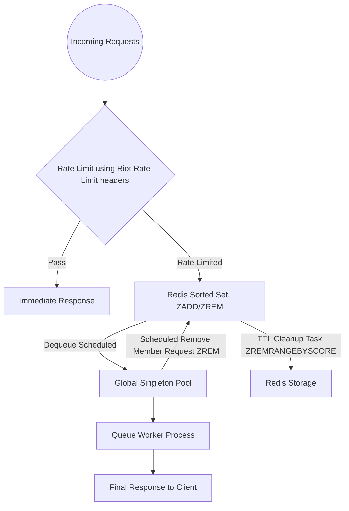

## Software Design Specification (SDS)

### Introduction

#### Project Overview

The project is a distributed multi-node system that fetches data from the Riot API, aggregates it, and serves it through a GraphQL API to our users.

#### Goal and Objectives

The primary goal of the project is to provide users with access to statistics for the past 30 matches in League of Legends for their selected players.

#### Expected Outcomes

The system should be able to handle incoming requests at a rate of 2000 RPS.

---

### Architecture

#### Umbrella Application Structure

The Umbrella Application will consist of five primary applications:

1. **Data Fetcher Application** — responsible for collecting data from the Riot API and preparing it for database storage.
2. **Schema Application** — manages database schemas and handles data aggregation.
3. **Web Application** — provides a GraphQL API to access aggregated data.
4. **Authentication Application** — identifies the current user.
5. **Authorization Application** — determines what actions a user is allowed to perform within the system.
6. **Pipeline Application**

---

### Integration with Riot Games API

#### Which Endpoints to Use

In a real-world application, the user retrieves their **Platform Universal User Identifier (PUUID)** using one of the following methods:

- **GET /lol/summoner/v4/summoners/me** — Get a summoner by access token
- **GET /riot/account/v1/accounts/by-riot-id/{gameName}/{tagLine}** — Get account by Riot ID (exchange Riot ID for PUUID)

In our showcase, we retrieve summoner IDs and PUUIDs using the following endpoints:

- **GET /lol/league/v4/entries/{queue}/{tier}/{division}** — Get all the league entries (retrieve summoner ID, PUUID)
- **GET /lol/summoner/v4/summoners/{encryptedSummonerId}** — (Optional) Get account id

We randomly associate summoners with our users, producing many-to-many relationship.

After obtaining the PUUID, the application uses it to fetch data for the last 30 matches via the following endpoint:

- **GET /lol/match/v5/matches/by-puuid/{puuid}/ids** — Get a list of match IDs by PUUID

Then, for each match ID, it retrieves the user's individual statistics using:

- **GET /lol/match/v5/matches/{matchId}** — Get a match by match ID

#### Rate Limiting and Queue Processing

##### Flow Diagram



##### 1. Rate Limiting with Hammer:

- Incoming requests are processed by Rate Limiter which is based on quotas and and quotas renew time calculated from the previous request. Quotas and renew time stored in redis cache.
- **Pass:** Allowed requests proceed directly to an immediate response.
- **Rate Limited:** Denied requests are stored in a Redis Sorted Set using ZADD, with timestamps as scores.

##### 2. Dequeue Scheduling:

- The Global Singleton Pool schedules a dequeue task after storing the denied request.
- This ensures that deferred processing happens at the rate specified in the configuration.

##### 3. Task Removal (ZREM):

- The Global Singleton Pool triggers a Scheduled Remove Member Request (ZREM) to dequeue tasks from the sorted set in FIFO order.

##### 4. TTL Cleanup with ZREMRANGEBYSCORE:

- The sorted set has a TTL Cleanup Task that periodically removes expired entries using ZREMRANGEBYSCORE.
- This keeps the queue clean and prevents outdated tasks from lingering.

##### 5. Worker Processing:

- The dequeued task is processed by a Queue Worker, which completes the request and sends the Final Response to the client.

#### Data Consistency and Freshness

(To be filled in)

#### Handling API Failures

(To be filled in)

---

### Data Storage

#### Database Choice and Justification

(To be filled in)

#### Schema Design

### users Table

**Purpose:** Stores basic information about application users.

| Field Name | Type   | Description           |
| ---------- | ------ | --------------------- |
| id         | bigint | Primary key           |
| name       | text   | User’s display name   |
| email      | text   | User’s email (unique) |

**Associations:**

- `has_many :user_players`
- `has_many :players, through: :user_players`

---

### players Table

**Purpose:** Represents individual League of Legends profiles (Riot accounts) linked by users.

| Field Name  | Type | Description                         |
| ----------- | ---- | ----------------------------------- |
| puuid       | text | Primary key (Riot global unique ID) |
| summoner_id | text | Riot Summoner ID (region-specific)  |
| region      | text | Player’s region                     |

**Associations:**

- `has_many :user_players`
- `has_many :users, through: :user_players`
- `has_many :player_matches`
- `has_many :matches, through: :player_matches`
- `has_one :player_aggregate`

---

### user_players Table (Join Table)

**Purpose:** Creates a many-to-many association between users and players.  
This allows multiple users to track the same Riot account.

| Field Name | Type   | Description              |
| ---------- | ------ | ------------------------ |
| user_id    | bigint | References users.id      |
| player_id  | text   | References players.puuid |

**Primary key:** `(user_id, player_id)`

**Associations:**

- `belongs_to :user`
- `belongs_to :player`

---

### matches Table

**Purpose:** Stores metadata about individual League of Legends matches.  
Each match can involve multiple players. Used to deduplicate matches quickly.

| Field Name | Type      | Description                  |
| ---------- | --------- | ---------------------------- |
| id         | uuid      | Primary key                  |
| match_id   | text      | Riot unique match identifier |
| region     | text      | Match region                 |
| game_start | timestamp | Match start timestamp        |
| game_end   | timestamp | Match end timestamp          |
| metadata   | jsonb     | Raw match data (optional)    |

**Unique constraint:** `(match_id, region)`

**Associations:**

- `has_many :player_matches`
- `has_many :players, through: :player_matches`

---

### player_matches Table

**Purpose:** Stores detailed stats of each player in a specific match.  
Tracks per-player performance metrics and associations to matches.

| Field Name                | Type    | Description                |
| ------------------------- | ------- | -------------------------- |
| id                        | uuid    | Primary key                |
| match_id                  | uuid    | References matches.id      |
| player_id                 | text    | References players.puuid   |
| champion_played           | text    | Champion played            |
| kills                     | integer | Kills in match             |
| deaths                    | integer | Deaths in match            |
| assists                   | integer | Assists in match           |
| gold_earned               | integer | Gold earned                |
| gold_spent                | integer | Gold spent                 |
| damage_dealt_to_champions | integer | Damage dealt to champions  |
| total_damage_dealt        | integer | Total damage dealt         |
| damage_taken              | integer | Damage taken               |
| vision_score              | integer | Vision score               |
| wards_placed              | integer | Wards placed               |
| wards_killed              | integer | Wards killed               |
| win                       | boolean | Win or loss                |
| metadata                  | jsonb   | Raw player data (optional) |

**Unique constraint:** `(match_id, player_id)`

**Associations:**

- `belongs_to :match`
- `belongs_to :player`

---

### player_aggregates Table (Last 30 Matches)

**Purpose:** Stores aggregated statistics for each player based on the last 30 matches.  
This allows quick access to summarized performance metrics.

| Field Name                    | Type      | Description                            |
| ----------------------------- | --------- | -------------------------------------- |
| player_id                     | text      | References players.puuid (primary key) |
| match_count                   | integer   | Matches aggregated (max 30)            |
| kills_avg                     | float     | Avg kills                              |
| assists_avg                   | float     | Avg assists                            |
| deaths_avg                    | float     | Avg deaths                             |
| damage_dealt_to_champions_avg | float     | Avg damage to champions                |
| total_damage_dealt_avg        | float     | Avg total damage dealt                 |
| damage_taken_avg              | float     | Avg damage taken                       |
| gold_earned_avg               | float     | Avg gold earned                        |
| gold_spent_avg                | float     | Avg gold spent                         |
| vision_score_avg              | float     | Avg vision score                       |
| wards_placed_avg              | float     | Avg wards placed                       |
| wards_killed_avg              | float     | Avg wards killed                       |
| updated_at                    | timestamp | Last updated timestamp                 |

**Associations:**

- `belongs_to :player`

#### Data Aggregation Strategy

Our aggregation strategy simplifies player analysis by clearly distinguishing two layers of statistics:

##### Core Statistics for Analysis:

For both primary and secondary aggregates, we calculate averages based on the following metrics:

- **Kill Metrics:** kills, assists, deaths.
- **Damage Metrics:** damageDealtToChampions, totalDamageDealt, damageTaken.
- **Gold Metrics:** goldEarned, goldSpent.
- **Vision Metrics:** visionScore, wardsPlaced, wardsKilled.

##### Example Data Structures:

```elixir
%PlayerAggregate{
  player_id: "primary_player_puuid",
  match_count: 30,
  kills_avg: 7.2,
  assists_avg: 4.1,
  deaths_avg: 3.8,
  damage_dealt_to_champions_avg: 23000,
  total_damage_dealt_avg: 180000,
  damage_taken_avg: 15000,
  gold_earned_avg: 12000,
  gold_spent_avg: 11500,
  vision_score_avg: 35,
  wards_placed_avg: 12,
  wards_killed_avg: 4,
  updated_at: ~U[2025-03-25 12:34:56Z]
}

#### Data Caching
(To be filled in)

---

### Data Processing

#### Work That Needs to Be Done

1. **Fetching and Storing Matches**
   - Retrieve recent matches for each user.
   - Persist raw match data for reliable processing.

2. **Aggregating Statistics per Player**
   - Select only the last 30 matches for each player.
   - Calculate average statistics across these 30 matches.
   - Maintain aggregates for players who frequently appear in searched users’ matches.

3. **Extracting Core Statistics**
   - Parse the response fields from the match data, specifically:
     - **Kill Metrics:** kills, assists, deaths
     - **Damage Metrics:** damageDealtToChampions, totalDamageDealt, totalDamageTaken
     - **Gold Metrics:** goldEarned, goldSpent
     - **Vision Metrics:** visionScore, wardsPlaced, wardsKilled

4. **Updating and Maintaining Aggregates**
   - Continuously update player stats as new matches arrive.
   - Ensure statistics always reflect the latest 30 matches.

#### Asynchronous Processing
(To be filled in)

#### Data Aggregation Workflows

---

### GenStage Pipeline

---

**Stage 1: `puuid_producer`**

- **Purpose:**
  Emits each player (`puuid`) to be processed.

- **Action:**
  - Reads from the `players` table using cursor-based pagination or batching.
  - Emits one event per `puuid`.

---

**Stage 2: `match_id_fetcher`**

- **Purpose:**
  Fetches match IDs from Riot API for each `puuid`, deduplicates them, and filters out already known matches.

- **Action:**
  - Receives `puuid` from Stage 1.
  - Calls Riot API to retrieve the latest 30 match IDs for that player.
  - Deduplicates IDs in memory using a `MapSet` or similar structure.
  - Queries the `matches` table to identify which match IDs are not yet stored.
  - Emits only new match IDs downstream.

---

**Stage 3: `match_data_fetcher`**

- **Purpose:**
  Fetches full match data and player statistics, then stores them in the database.

- **Action:**
  - Receives new match IDs from Stage 2.
  - Calls Riot API to fetch detailed match data.
  - Stores match metadata in the `matches` table.
  - Stores individual player performance in the `player_matches` table.

#### Failure Recovery Mechanisms
(To be filled in)

---

### API and Interface

#### GraphQL API Design

##### Queries

1. **fetch_me**
  Desc: Fetch the current user, including their email.
  Arguments: `name`
  Fields: `id`, `name`, `email`

2. **search_users**
  Desc: Fetch other users by their name; emails are excluded.
  Arguments: `name`
  Fields: `id`, `name`

3. **get_user_players**
  Desc: Get a list of players associated with a specific user.
  Arguments: `user_id`
  Fields: `summoner_id`, `puuid`, `region`

4. **get_user_matches**
  Desc: Get matches related to a specific user, based on their linked players.
  Arguments: `user_id`, optional pagination
  Fields: Match details (`match_id`, `timestamp`, `participants`, `stats`)

5. **get_player_matches**
  Desc: Get matches for a specific player.
  Arguments: `puuid`, `region`, optional pagination
  Fields: Match details (`match_id`, `timestamp`, `participants`, `stats`)

6. **get_user_match_stats_aggregate**
  Desc: Get aggregated statistics for the last 30 matches played by a user.
  Arguments: `user_id`
  Fields: Aggregated stats

##### Mutations

1. **signup_user**
  Desc: Register a new user via email and password (or email OTP).
  Arguments: `email`, `password` (or OTP fields)
  Returns: `user_id`, `name`, `email`

2. **signin_user**
  Desc: Authenticate user credentials and provide a session token.
  Arguments: `email`, `password` (or OTP fields)
  Returns: `session_token`, `user_id`

3. **signout_user**
  Desc: Sign out the authenticated user.
  Arguments: `session_token`
  Returns: confirmation (`success`)

4. **add_player**
  Desc: Link a player to a user.
  Authenticated operation.
  Arguments: `puuid`
  Returns: `summoner_id`, `puuid`, `region`

5. **remove_player**
  Desc: Unlink a player from the user.
  Authenticated operation.
  Arguments: `puuid`
  Returns: confirmation (`success`)

##### Subscriptions

1. **user_new_matches**
  Desc: Subscribe to notifications when the authenticated user has new matches.
  Arguments: `user_id`
  Returns: Real-time updates of match details (`match_id`, `timestamp`, `summary_stats`)

2. **player_new_matches**
  Desc: Subscribe to notifications when a specific player has new matches.
  Arguments: `puuid`
  Returns: Real-time updates of match details (`match_id`, `timestamp`, `summary_stats`)

#### Endpoint Specifications
(To be filled in)

#### Authentication and Authorization Flow
(To be filled in)

---

### Monitoring and Logging

#### Performance Monitoring
(To be filled in)

#### Error and Exception Handling
(To be filled in)

#### Logging Strategy
(To be filled in)

---

### Testing and CI/CD

#### Automated Testing
(To be filled in)

#### Integration Testing
(To be filled in)

#### Continuous Integration and Deployment
(To be filled in)

---

### Documentation and Guidelines

#### Deployment Guide
(To be filled in)

#### User Documentation
(To be filled in)

#### Maintenance Guidelines
(To be filled in)

---

```
